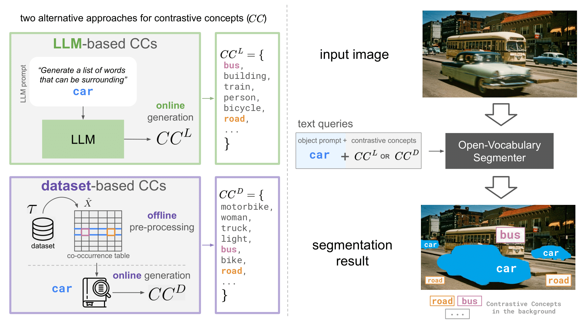

# Test-time Contrastive Concepts
Official repository for [Test-time Contrastive Concepts for Open-world Semantic Segmentation with Vision-Language Models (TMLR 2025)](https://arxiv.org/pdf/2407.05061)




### This repository contains:
1. Code to extract Contrastive Concepts (CC) based on statistics from CLIP pre-training dataset (Laion). 
2. LLM-based CCs used in our paper.
3. [Soon to be released] Code for our proposed IoU-single metric 


## Installation

```
conda create --name ccs python=3.9
conda activate ccs

conda install pytorch==2.4.1 torchvision==0.19.1 pytorch-cuda=[XX]-c pytorch -c nvidia
```
Next, install the rest of necessary requirements:


```
pip install -r requirements.txt
```

## CC extraction

1. Download pre-computed co-occurrence matrix of concepts in Laion dataset from [here](https://drive.google.com/file/d/1Smm-h3cyYoVX0XPwS1_PFSCXnESnnVYt/view?usp=sharing)
2. Run get_ccs.py to obtain list of CCs for given prompts, e.g. (for prompts of classes Cityscapes dataset):

```
python get_ccs.py --vocab_file laion400m_lemmatized.pkl --results_dir outputs --filter_file laion_concepts_map_v5.json --prompts_file prompts/cls_cityscapes.txt --gamma 0.01 --delta 0.8
```

If you wish to extract CCs for arbitrary prompts simply prepare an input .txt file where each line is a separate prompt (see examples in the ```prompts``` directory). Then run: 

```
python get_ccs.py --vocab_file laion400m_lemmatized.pkl --results_dir outputs --filter_file laion_concepts_map_v5.json --prompts_file [YOUR PROMPT FILE] --gamma 0.01 --delta 0.8
```

